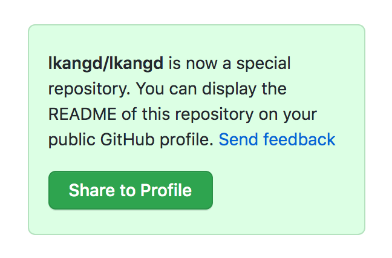
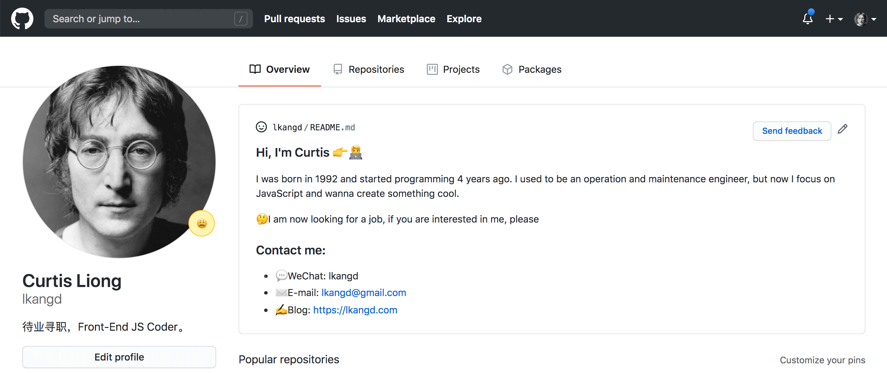
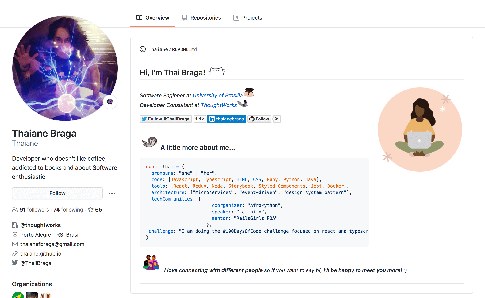

最近 github 网站频频改版，前两天在[本博客](https://lkangd.com/){target=\_blank}托管的 [仓库](https://github.com/lkangd/lkangd){target=\_blank}右侧发现了一个有趣的提示：


点击`Share to Profile`，然后发现这个项目根目录的 README.md 的内容出现在了 github 的个人资料页处。

google 了一下，发现是 github 最近上线的新功能，当用户创建同名仓库的时候，可以使用同名仓库内的 README.md 作为 Profile 页的说明。

操作步骤如下：

1. 创建同名仓库：
   在创建 repo 的页面输入跟你当前用户名一样的仓库名，会弹出一个提示框：
   

> You found a secret! **lkangd/lkangd** is a ✨special ✨ repository that you can use to add a README.md to your GitHub profile. Make sure it’s public and initialize it with a README to get started.

绿框内的文字提示，跟当前用户的用户名同名的仓库，项目根目录内的 README.md 可以作为 GitHub Profile 的个性说明。需要注意的是这个仓库必须是`Public`的。

2. 编辑 README.md:
   比如我的 README.md 内容：

```md
### Hi, I'm Curtis 👉🧑‍💻

I was born in 1992 and started programming 4 years ago. I used to be an operation and maintenance engineer, but now I focus on JavaScript and wanna create something cool.

🤔I am now looking for a job, if you are interested in me, please

### Contact me:

- 💬WeChat: lkangd
- ✉️E-mail: lkangd@gmail.com
- ✍️Blog: https://lkangd.com
```

3. 推送 README.md 到 github：
   把刚刚编辑完成的 README.md，commit，然后 git push 到 github，就可以看到效果啦，如下：
   

---

### Github 上一些有趣的 READMEs

既然是用 md 去写 Profile 页，当然就不仅限于用文字或链接进行表达，它可以是：

- 代码块：
  
- 图文并茂：
  
- 死宅动漫动图：
  
- 甚至可以通过 pull request 来玩游戏：
  

有人专门创建了一个仓库去收集这些有趣的 READMEs，有兴趣可以去看看 [看看](https://github.com/abhisheknaiidu/awesome-github-profile-readme){target=\_blank}

发挥你的想象力去创造一个个性的 Profile 页吧，Have fun 😬。
