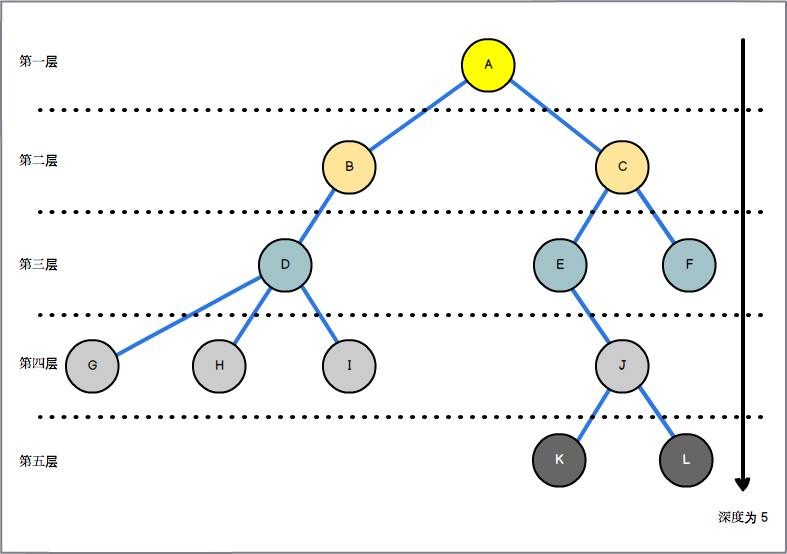
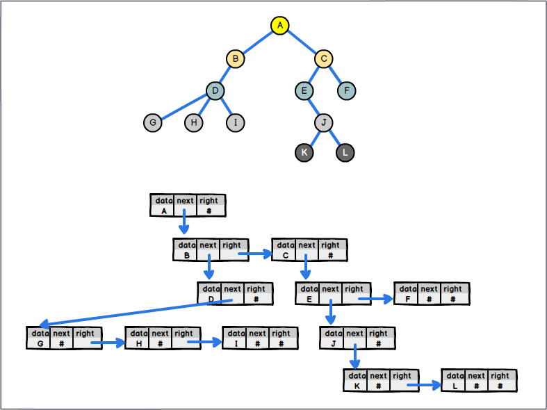
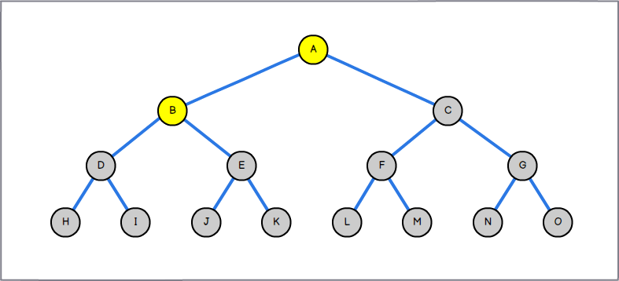
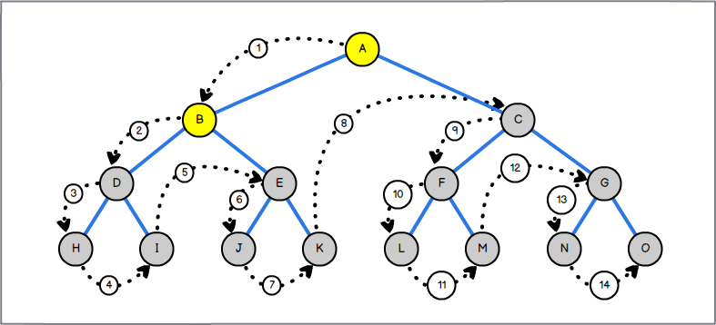
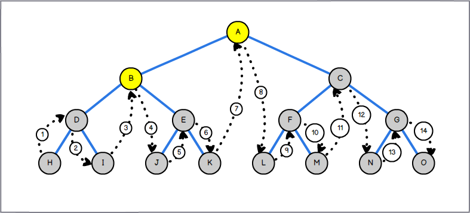
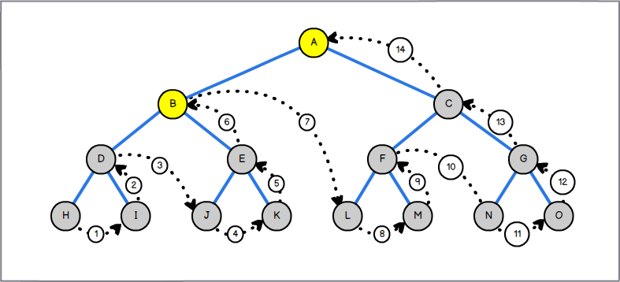

[[TOC]]

## 什么是树？

### 定义

树（Tree）是 n（n >= 0）个结点的有限集合。n = 0 时称为空树。在任意一棵非空树中：

- **有且仅有一个**特定的称为根（Root）的结点；
- 当 n > 1 时，其余结点可分为 m（m > 0）个互不相交的有限集合 T1、T2、...、Tm，其中每一个集合本身又是一棵树，并且称为根的子树（SubTree）；
- 所有子树的集合称为**森林（Forest）**；
- 树中结点的各子树如果从左至右是有次序且不能互换的，称为有序树，否则称为无序树；
  

### 结点分类

树的结点包含一个数据元素和若干指向其子树的分支。
结点拥有的子树称为结点的`度（Degree）`。度为 0 的结点称为**叶结点（Leaf）**；度不为 0 的结点称为**分支结点**。除根结点外，分支结点也称为内部结点。树的度是**树内各结点的度最大值**。


### 结点关系

结点的下一层分支称为改结点的**子结点（Child）**，结点的上一层分支称为该结点的**父结点（Parent）**。同一个父结点的结点之间称为**兄弟结点（Sibling）**。结点上层所有的结点称为该结点的**祖先结点**，反之，结点下层所有的结点称为该节点的**子孙结点**。


### 层与深度

结点的 **层次（level）** 从根开始定义，根为第一层，根的子结点为第二层，依次类推。父结点在同一层的同层结点互为堂兄弟结点，如  G、H、I 与 J 互为堂兄弟结点。

树中结点最大层次称为树的 **深度（Depth）** ，当前树的深度为 5 。


---

## 存储结构

子结点个数无限制的有根树有 3 种常用的关系表示法进行数据存储，

- **父母表示法**
- **孩子表示法**
- **左孩子右兄弟表示法（left-child, right-sibling representation）**

### 父母表示法

父母表示法的一般做法是使用线性的存储结构，将每个结点**按结点所在层次**从左往右依次记录在该线性存储结构内（数组），在存储每个结点时，使用一个变量存储其父结点所在的下标。父结点的下标为 **-1**，当需要遍历一棵树时，遍历到下标为 **-1** 时就可知道整棵树已经完成遍历。

要点：

- 使用数组依次存储所有结点；
- 每个结点内记录父结点的数组下标；
  

当业务场景需要频繁查找某结点的父结点时，这种表示法最合适，所需的时间复杂度为**O(1)**。

#### 代码实现

```javascript
class TreeNode {
  constructor(data, parentSub) {
    this.data = data;
    this.parent = parentSub;
  }
}

class Tree {
  constructor() {
    this.data = [];
  }
  // 返回树的深度
  treeDepth() {
    if (this.data.filter(Boolean).length === 0) return 0;

    let lastChild = Math.max.apply(
      null,
      this.data.map(node => node && node.parent),
    );
    lastChild = this.data[lastChild];
    let depth = 1;
    while (~lastChild.parent) {
      lastChild = this.data[lastChild.parent];
      depth++;
    }
    return depth + 1;
  }
  // 插入结点
  insertChild(node) {
    if (this.data[0] && !this.data[node.parent]) {
      return false;
    }
    for (let i = 0; i < this.data.length; i++) {
      if (this.data[i] === null) {
        this.data[i] = node;
        return true;
      }
    }
    this.data.push(node);
    return true;
  }
  // 删除结点及其子树
  deleteChild(node) {
    const nodeSub = this.data.indexOf(node);
    if (nodeSub !== -1) {
      this.data[nodeSub] = null;
      const needDels = [nodeSub];
      for (let i = 0, n; i < this.data.length; i++) {
        n = this.data[i];
        if (n && needDels.indexOf(n.parent) !== -1) {
          this.data[i] = null;
          needDels.push(i);
        }
      }
      return true;
    }
    return false;
  }
}

// 初始化树，结点
const tree = new Tree();
const A = new TreeNode('A', -1);
const B = new TreeNode('B', 0);
const C = new TreeNode('C', 0);
const D = new TreeNode('D', 1);
const E = new TreeNode('E', 2);
const F = new TreeNode('F', 2);
const G = new TreeNode('G', 3);
const H = new TreeNode('H', 3);
const I = new TreeNode('I', 3);
const J = new TreeNode('J', 4);
const K = new TreeNode('K', 9);
const L = new TreeNode('L', 9);
const M = new TreeNode('M', 9);

// 插入结点
tree.insertChild(A);
tree.insertChild(B);
tree.insertChild(C);
tree.insertChild(D);
tree.insertChild(E);
tree.insertChild(F);
tree.insertChild(G);
tree.insertChild(H);
tree.insertChild(I);
tree.insertChild(J);
tree.insertChild(K);
tree.insertChild(L);

// 测试
tree.deleteChild(M); // false 结点不存在树内
tree.deleteChild(D); // true
tree.treeDepth(); // 5
tree.deleteChild(J); // true
tree.treeDepth(); // 3
tree.insertChild(J);
tree.treeDepth(); // 4
```

### 孩子表示法

孩子表示法跟父母表示法做法类似，也是使用线性的存储结构，将每个结点**按结点所在层次**从左往右依次记录在该线性存储结构内（数组），但是在存储每个结点时，将该结点的孩子结点排列成一个线性表（链表）。所以对于有 n 个结点的数来说，就会有 n 个单链表。

要点：

- 使用数组依次存储所有结点；
- 每个结点维护一个指向该结点所有孩子的链表；
  

#### 代码实现

```javascript
class TreeNode {
  constructor(data, next = null) {
    this.data = data;
    this.next = next;
  }
  setNext(next = null) {
    this.next = next;
  }
}

class TreeNodeChain {
  constructor(treeNodeSub, next = null) {
    this.treeNodeSub = treeNodeSub;
    this.next = next;
  }
  setNext(next = null) {
    this.next = next;
  }
  setSub(treeNodeSub) {
    this.treeNodeSub = treeNodeSub;
  }
}

class Tree {
  constructor() {
    this.data = [];
  }
  treeDepth() {
    if (this.data.filter(Boolean).length === 0) return 0;

    let result = 0;
    const root = this.data[0];
    const getDepth = (node, _depth = 1) => {
      if (node.next) {
        let nextChild = node.next;
        getDepth(this.data[nextChild.treeNodeSub], _depth + 1);
        while (nextChild && nextChild.next) {
          getDepth(this.data[nextChild.next.treeNodeSub], _depth + 1);
          nextChild = nextChild.next;
        }
      }
      result = Math.max(result, _depth);
    };
    getDepth(root);
    return result;
  }
  insertChild(node) {
    for (let i = 0; i < this.data.length; i++) {
      if (this.data[i] === null) {
        this.data[i] = node;
        return i;
      }
    }
    this.data.push(node);
    return this.data.length - 1;
  }
  deleteChild(delNode) {
    const nodeSub = this.data.indexOf(delNode);
    if (nodeSub !== -1) {
      this.data[nodeSub] = null;
      // 删除孩子和结点所维持的链表
      while (delNode.next) {
        let prev = delNode;
        delNode = delNode.next;
        prev.setNext(null);
        this.data[delNode.treeNodeSub] = null;
      }

      // 更新父母链表关系
      for (let i = 0; i < this.data.length; i++) {
        let node = this.data[i];
        while (node && node.next) {
          if (node.next.treeNodeSub === nodeSub) {
            node.next = node.next.next;
            return true;
          } else {
            node = node.next;
          }
        }
      }
      return true;
    }
    return false;
  }
}

// 初始化树，结点
const tree = new Tree();
const A = new TreeNode('A');
const B = new TreeNode('B');
const C = new TreeNode('C');
const D = new TreeNode('D');
const E = new TreeNode('E');
const F = new TreeNode('F');
const G = new TreeNode('G');
const H = new TreeNode('H');
const I = new TreeNode('I');
const J = new TreeNode('J');
const K = new TreeNode('K');
const L = new TreeNode('L');
const M = new TreeNode('M');

// 插入结点
tree.insertChild(A);
tree.insertChild(B);
tree.insertChild(C);
tree.insertChild(D);
tree.insertChild(E);
tree.insertChild(F);
tree.insertChild(G);
tree.insertChild(H);
tree.insertChild(I);
tree.insertChild(J);
tree.insertChild(K);
tree.insertChild(L);

// 设置关系
const A1 = new TreeNodeChain(1);
const A2 = new TreeNodeChain(2);
A.setNext(A1);
A1.setNext(A2);

const B1 = new TreeNodeChain(3);
B.setNext(B1);

const C1 = new TreeNodeChain(4);
const C2 = new TreeNodeChain(5);
C.setNext(C1);
C1.setNext(C2);

const D1 = new TreeNodeChain(6);
const D2 = new TreeNodeChain(7);
const D3 = new TreeNodeChain(8);
D.setNext(D1);
D1.setNext(D2);
D2.setNext(D3);

const E1 = new TreeNodeChain(9);
E.setNext(E1);

const J1 = new TreeNodeChain(10);
const J2 = new TreeNodeChain(11);
J.setNext(J1);
J1.setNext(J2);

// 测试
tree.deleteChild(M); // false 结点不存在树内
tree.deleteChild(D); // true
D.next; // null
D1.next; // null
D2.next; // null
tree.treeDepth(); // 5
tree.deleteChild(J); // true
J.next; // null
J1.next; // null
J2.next; // null
tree.treeDepth(); // 3
tree.deleteChild(H); // false
tree.treeDepth(); // 3

const newIndex = tree.insertChild(J); // 3
E1.setSub(newIndex);
E.setNext(E1);
tree.treeDepth(); // 4
```

使用孩子表示法存储的树结构，正好和父母表示法相反，适用于查找某结点的孩子结点，不适用于查找其父结点。但是因为每个结点都维持了一个链表，所以空间复杂度会大大增加。

从上面两种的实现原理和代码，不难发现可以结合“父母表示法”和“孩子表示法”来实现一种特殊的“父母孩子表示法”，适合同时需要频繁“父母”和“孩子”的场景，是一种常用的“空间”换“时间”的手段。

### 孩子兄弟表示法

与上述两种表示法不同的是，这种表示法不再需要声明额外的空间进行所有结点的存储，而是直接使用链式存储结构来关进行结点关联，因为只有两个指针域指向，所有这种表示法其实是将一棵不限定子结点数量的有根树转换成了 **“二叉树”**。

要点：

- 生成 node 存储结构，除数据域 “data” 外，该 node 拥有 “next” 和 “right” 两个特殊属性；
- node.next 指向 node 最左边的第一个孩子；
- node.right 指向 node 右边的第一个兄弟；
  

#### 代码实现

```javascript
class TreeNode {
  constructor(data, next = null, right = null) {
    this.data = data;
    this.next = next;
    this.right = right;
  }
  setNext(next = null) {
    this.next = next;
  }
  setRight(right = null) {
    this.right = right;
  }
}

function insertNode(parent, treeNode) {
  let prev = parent.next;
  parent.next = treeNode;
  treeNode.right = prev;
}
function deleteNode(root, target) {
  target.next = null;
  const update = node => {
    if (node.next === target) {
      if (target.right) {
        node.next = target.right;
      } else {
        node.next = null;
      }
    } else if (node.right === target) {
      node.right = null;
    }
    node.next && update(node.next);
    node.right && update(node.right);
  };
  update(root);
}
function treeDepth(root) {
  let result = 0;
  const getDepth = (node, _depth = 1) => {
    if (node.next) {
      let nextChild = node.next;
      getDepth(nextChild, _depth + 1);
      while (nextChild && nextChild.right) {
        // 向右遍历层数不增加
        getDepth(nextChild.right, _depth);
        nextChild = nextChild.right;
      }
    }
    result = Math.max(result, _depth);
  };
  getDepth(root);
  return result;
}

// 初始化结点
const A = new TreeNode('A');
const B = new TreeNode('B');
const C = new TreeNode('C');
const D = new TreeNode('D');
const E = new TreeNode('E');
const F = new TreeNode('F');
const G = new TreeNode('G');
const H = new TreeNode('H');
const I = new TreeNode('I');
const J = new TreeNode('J');
const K = new TreeNode('K');
const L = new TreeNode('L');
const M = new TreeNode('M');

// 设置结点关系
A.setNext(B);
B.setNext(D);
B.setRight(C);
C.setNext(E);
D.setNext(G);
E.setNext(J);
E.setRight(F);
G.setRight(H);
H.setRight(I);
J.setNext(K);
K.setRight(L);

// 测试
deleteNode(A, C);
treeDepth(A); // 4
deleteNode(A, D);
treeDepth(A); // 2
C.setNext(E);
E.setNext(J);
E.setRight(F);
J.setNext(K);
K.setRight(L);
insertNode(A, C);
treeDepth(A); // 5
```

通过孩子兄弟表示法，普通树转化为了二叉树，所以孩子兄弟表示法又被称为 **“二叉树表示法**”或者 **“二叉链表表示法”**。

---

## 常用树结构：二叉树

### 二叉树定义

二叉树（Binary Tree）是 n（n >= 0）个结点的有限集合，该集合或者为空集（空二叉树），或者由一个根结点和两课互不相交的、分别称为根结点的左子树和右子树的二叉树组成。在一棵二叉树中：

- 每个结点最多有两棵子树，树中不存在度大于 2 的结点；
- 左子树和右子树是有顺序的，次序不能颠倒；
- 即使树中某个结点只有子结点，也必须区分该结点是左结点还是右结点；
- 有五种基本形态：空二叉树、只有根结点、根结点只有左子树、根结点只有右子树、根结点同时具有左子树和右子树；
  

### 二叉树存储结构

二叉树常用的存储结构有两种，分别是线性的数组存储和链接存储，线性数组存储一般只适用于[完全二叉树](https://baike.baidu.com/item/%E5%AE%8C%E5%85%A8%E4%BA%8C%E5%8F%89%E6%A0%91){target=\_blank}，这里不作详细讨论，只着重讲解更普遍适用的链式存储结构。

#### 代码实现

```javascript
class TreeNode {
  constructor(data, leftChild = null, rightChild = null) {
    this.data = data;
    this.leftChild = leftChild;
    this.rightChild = rightChild;
  }
  setLeft(leftChild = null) {
    this.leftChild = leftChild;
  }
  setRight(rightChild = null) {
    this.rightChild = rightChild;
  }
}
// 前序生成二叉树
function createBiTree(datas) {
  const data = datas.shift();
  if (data) {
    const root = new TreeNode(data);
    const leftChild = createBiTree(datas);
    const rightChild = createBiTree(datas);
    root.setLeft(leftChild);
    root.setRight(rightChild);
    return root;
  } else {
    return null;
  }
}

// 生成树
const tree = createBiTree([
  'A',
  'B',
  'D',
  'H',
  null,
  null,
  'I',
  null,
  null,
  'E',
  'J',
  null,
  null,
  'K',
  null,
  null,
  'C',
  'F',
  'L',
  null,
  null,
  'M',
  null,
  null,
  'G',
  'N',
  null,
  null,
  'O',
  null,
  null,
]);
```

观察代码实现可以发现，因为二叉树的特殊性质，对于树的生成，不需要再一个一个手动生成和关联结点间的关系，而是将树结构按“前序”的方式排列装入数组，然后借助一个特殊的“前序”生成辅助函数来生成树。

下面来介绍二叉树的“前序”、“中序”、“后序”三种遍历方式的实现原理和实现方式。

### 二叉树遍历

二叉树的遍历（traversing binary tree）是指从根结点出发，按照某种 **`次序`** 依次 **`访问`** 二叉树中的所有结点，使得每个结点都被访问一次，且仅被只访问一次。

#### 前序遍历

规则是若二叉树为空，则空操作返回，否则先访问根结点，然后前序遍历左子树，再前序遍历右子树。如下图，遍历顺序为 A，B，D，H，I，E，J，K，C，F，L，M，G，N，O。


##### 代码实现

```javascript{6,7,8}
// 前序遍历
function preOrderTraverse(treeNode) {
  if (treeNode === null) {
    return;
  }
  console.log('treeNode.data :>> ', treeNode.data);
  preOrderTraverse(treeNode.leftChild);
  preOrderTraverse(treeNode.rightChild);
}

preOrderTraverse(tree);
// treeNode.data :>>  A
// treeNode.data :>>  B
// treeNode.data :>>  D
// treeNode.data :>>  H
// treeNode.data :>>  I
// treeNode.data :>>  E
// treeNode.data :>>  J
// treeNode.data :>>  K
// treeNode.data :>>  C
// treeNode.data :>>  F
// treeNode.data :>>  L
// treeNode.data :>>  M
// treeNode.data :>>  G
// treeNode.data :>>  N
// treeNode.data :>>  O
```

留意代码实现的高亮部分，这里使用 console 的方式来进行数据访问的操作，逻辑的顺序是：**访问数据 => 递归左子树 => 递归右子树**，数据访问操作放在两个递归操作的**前面**，根结点的访问在最前面。

#### 中序遍历

规则是若树为空，则空操作返回，否则从根结点开始（注意不是先访问根结点），中序遍历根结点的左子树，然后是访问根结点，最后是中序遍历右子树，如下图，遍历顺序为 H，D，I，B，J，E，K，A，L，F，M，C，N，G，O。


##### 代码实现

```javascript{6,7,8}
// 中序遍历
function inOrderTraverse(treeNode) {
  if (treeNode === null) {
    return;
  }
  inOrderTraverse(treeNode.leftChild);
  console.log('treeNode.data :>> ', treeNode.data);
  inOrderTraverse(treeNode.rightChild);
}

inOrderTraverse(tree);
// treeNode.data :>>  H
// treeNode.data :>>  D
// treeNode.data :>>  I
// treeNode.data :>>  B
// treeNode.data :>>  J
// treeNode.data :>>  E
// treeNode.data :>>  K
// treeNode.data :>>  A
// treeNode.data :>>  L
// treeNode.data :>>  F
// treeNode.data :>>  M
// treeNode.data :>>  C
// treeNode.data :>>  N
// treeNode.data :>>  G
// treeNode.data :>>  O
```

留意代码实现的高亮部分，这里使用 console 的方式来进行数据访问的操作，逻辑的顺序是：**递归左子树 => 访问数据 => 递归右子树**，数据访问操作放在两个递归操作的**中间**，根结点的访问在正中间。

#### 后序遍历

规则是若树为空，则空操作返回，否则从左到右先叶子结点的方式遍历访问左右子树，最后是访问根结点。如下图，遍历顺序是 H，I，D，J，K，E，B，L，M，F，N，O，G，C，A。


##### 代码实现

```javascript{6,7,8}
// 后序遍历
function postOrderTraverse(treeNode) {
  if (treeNode === null) {
    return;
  }
  postOrderTraverse(treeNode.leftChild);
  postOrderTraverse(treeNode.rightChild);
  console.log('treeNode.data :>> ', treeNode.data);
}

postOrderTraverse(tree);
// treeNode.data :>>  H
// treeNode.data :>>  I
// treeNode.data :>>  D
// treeNode.data :>>  J
// treeNode.data :>>  K
// treeNode.data :>>  E
// treeNode.data :>>  B
// treeNode.data :>>  L
// treeNode.data :>>  M
// treeNode.data :>>  F
// treeNode.data :>>  N
// treeNode.data :>>  O
// treeNode.data :>>  G
// treeNode.data :>>  C
// treeNode.data :>>  A
```

留意代码实现的高亮部分，这里使用 console 的方式来进行数据访问的操作，逻辑的顺序是：**递归左子树 => 递归右子树 => 访问数据**，数据访问操作放在两个递归操作的**后面**，根结点的访问在最后面。

#### 补充

前面说树的表示法时，提到“孩子兄弟表示法”又称为 **“二叉树表示法**”，再结合二叉树的定义，可以得知其实所有有根树都可以转换为一棵 **_根结点没有右子树_** 的二叉树，篇幅有限这里不再展开，推荐一篇文章：[树和森林与二叉树的相互转换](https://zhuanlan.zhihu.com/p/134251528){target=\_blank}
