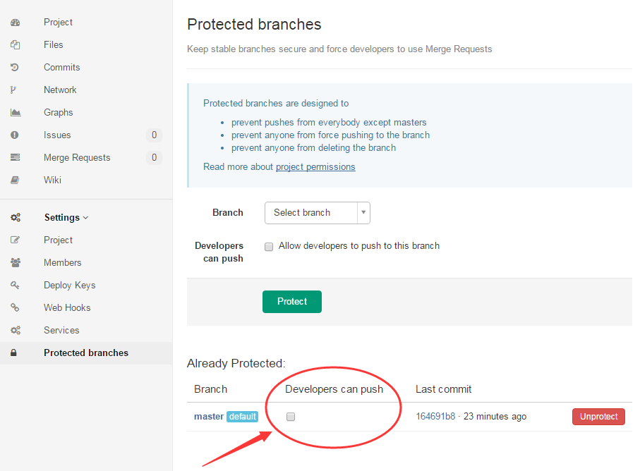

[[TOC]]

大部分技术团队都会选择 git 来作为代码库的版本管理工具，但是由于规范的缺失和技术人员 git 技能不达标的原因，很容易写出很敷衍潦草的「commit」描述和随意地合并推送到远程分支，导致「git log」日志看起来乱糟糟的。在项目工程化的角度而言，一个规范清晰的的「git log」日志是很重要的，因为它反映了项目是如何紧跟业务进行一步步迭代下来的，就像是软件开发的航海日志、黑匣子，在遇到「风浪」时，能快速定位问题和进行版本回退。

首先来看一段 [Vue](https://github.com/vuejs/vue){target=\_blank} 的「git log」记录，它长这样：

```bash
* 7721febc (tag: v2.6.0-beta.3) build: release 2.6.0-beta.3 - Evan You, 1 year, 5 months ago
* 9f3cbafa build: build 2.6.0-beta.3 - Evan You, 1 year, 5 months ago
* 2afa1d05 build: fix feature flags for esm builds - Evan You, 1 year, 5 months ago
* c9e3a5d1 feat: detect and warn invalid dynamic argument expressions - Evan You, 1 year, 5 months ago
* 624c7993 (tag: v2.6.0-beta.2) build: release 2.6.0-beta.2 - Evan You, 1 year, 5 months ago
* 90f47d1b build: build 2.6.0-beta.2 - Evan You, 1 year, 5 months ago
* dbc05825 feat: dynamic directive arguments for v-on, v-bind and custom directives (#9373) - Evan You, 1 year, 5 months ago
* f219beda perf: improve scoped slots change detection accuracy (#9371) - Evan You, 1 year, 5 months ago
| * 8b8921b2 (origin/dynamic-directive-arguments) feat: dynamic args for custom directives - Evan You, 1 year, 5 months ago
| * 2910d401 test: test cases for v-on/v-bind dynamic arguments - Evan You, 1 year, 5 months ago
| * 49c6f29f refactor: v-bind dynamic arguments use bind helper - Evan You, 1 year, 5 months ago
| * 5b5f6663 test: fix tests, resolve helper conflict - Evan You, 1 year, 5 months ago
| * 2ba897eb fix: fix middle modifier - Evan You, 1 year, 5 months ago
| * 5cb59b1f feat: handle dynamic argument for v-bind.sync - Evan You, 1 year, 5 months ago
| * c6f480ca feat: dynamic directive arguments for v-bind and v-on - Evan You, 1 year, 5 months ago
|/
| * d91a38ab (origin/slot-optimization) perf: improve scoped slots change detection accuracy - Evan You, 1 year, 5 months ago
|/
* 770c6ed6 refactor: extend dom-props update skip to more all keys except value - Evan You, 1 year, 5 months ago
* 18685614 fix: fix checkbox event edge case in Firefox - Evan You, 1 year, 5 months ago
* 8cb2069a test: fix tests in IE/Edge - Evan You, 1 year, 5 months ago
* 32072e8a refactor: simplify timestamp check - Evan You, 1 year, 5 months ago
* 60a277ca chore: update comment - Evan You, 1 year, 5 months ago
* ba0ebd47 fix: async edge case fix should apply to more browsers - Evan You, 1 year, 5 months ago
* ba9907c7 chore: update sponsor - Evan You, 1 year, 6 months ago
* 8d845724 feat: warning for ambiguous v-slot usage - Evan You, 1 year, 6 months ago
```

提交描述清晰，规范整洁。

但是我们看过的大多数「git log」日志却是下面这样的：

```bash
| * | | | | | | e63cdb7f htmlPlugin baseConf 中引入 - lisi, 8 months ago
| * | | | | | |   d6481470 Merge remote-tracking branch 'origin/master' into build-merge - lisi, 8 months ago
| |\ \ \ \ \ \ \
| * | | | | | | | 551b601b 商品详情富文本图片懒加载 - lisi, 8 months ago
| * | | | | | | |   804b8589 Merge branch 'master' into build-merge - lisi, 8 months ago
| |\ \ \ \ \ \ \ \
| * | | | | | | | | dd7b66b9 cacheLoader - lisi, 8 months ago
| * | | | | | | | | 0e91b705 构建脚本 - lisi, 8 months ago
| * | | | | | | | | 552d8576 sass 深度选择器 /deep/ => >>> - lisi, 8 months ago
| * | | | | | | | | f29a0dbb 改目录结构 - lisi, 8 months ago
* | | | | | | | | |   a930dda2 (tag: v20191119) Merge branch 'alipayFix' into 'master' - wangwu, 8 months ago
|\ \ \ \ \ \ \ \ \ \
| |_|_|/ / / / / / /
|/| | | | | | | / /
| | |_|_|_|_|_|/ /
| |/| | | | | | |
| * | | | | | | | 2d29a500 支付宝提示文案 - lisi, 8 months ago
| | |_|_|_|_|/ /
| |/| | | | | |
| * | | | | | | a6313a9e 混合支付 支付宝提示框 - lisi, 8 months ago
| | |_|_|_|/ /
| |/| | | | |
| * | | | | | 75b452e3 默认选中支付方式 - lisi, 8 months ago
| | |_|_|/ /
| |/| | | |
| * | | | | a1d3de5e payTypeShow 隐藏支付宝 - lisi, 8 months ago
| | |_|/ /
| |/| | |
| * | | | a0358dde 下线 支付宝支付 - lisi, 8 months ago
|/ / / /
* | | |   6be57861 Merge branch 'patch-1' into 'master' - zhangsan, 8 months ago
|\ \ \ \
| |_|/ /
|/| | |
| * | | 4e8f204b (origin/patch-1) 去营销 - zhangsan, 8 months ago
|/ / /
* | |   18ea26e4 Merge branch '20191114' into 'master' - zhangsan, 8 months ago
|\ \ \
| * | | d03b6d09 (origin/20191114) getKamiGoodsSpu - lisi, 8 months ago
```

多个提交出现了类似 “cacheLoader” 这样看起来莫名其妙的描述，过期的分支没有及时删除，多分支合并扰乱视线，整个记录看起来就像是一张「蜘蛛网」，如果要回溯一个业务功能的迭代过程，会让人很抓狂。

仔细观察 Vue 的「git log」日志，不难发现它的的优点主要有四个：

- **Commit 描述清晰，第一个单词说明此次提交的类别，后续描述第一个单词以 **_动词_**（一般现在时）开头；**
- **整个记录随合并时间呈 **_单支线性_** 向上累加，没有出现过期的，扰乱视线的分叉；**
- 如果是 issue 相关，每个提交后面会紧跟 issue 的 hash tag（可选）；
- 当需要发布版本时，以版本号打上 tag 标记（可选）；
- 除了简短描述外，还有详细的描述（可选）；

第三点到最后一点都是可选的，只要做到前面点就可以拥有一份整洁清晰的「git log」记录了，下面开始对实现这两点的方式进行探讨。

## 先从提交格式入手

那么 vue 是怎么做到提交格式这么规范统一的呢？作为多人协作的开源库，靠约定和人为自觉肯定是不现实的。打开 vue 项目的 package.json 可以发现几个关键的地方，vue 使用了[「commitizen」](https://github.com/commitizen/cz-cli){target=\_blank}来代替「git commit」进行代码提交，使用[「cz-conventional-changelog」](https://github.com/commitizen/cz-conventional-changelog){traget=\_blank}来指定「commitizen」的 Adapter。最后，在 git 的[「commit-msg」钩子](https://git-scm.com/book/zh/v2/%E8%87%AA%E5%AE%9A%E4%B9%89-Git-Git-%E9%92%A9%E5%AD%90){target=\_blank}指定了一个「commit」描述验证脚本[verify-commit-msg.js](https://github.com/vuejs/vue/blob/dev/scripts/verify-commit-msg.js){target=\_blank}，当脚本返回的值以非零值退出，就会提交失败，以一种强制的方式进行把关。

```json
{
  "scripts": {
    "commit": "git-cz"
  },
  "devDependencies": {
    "commitizen": "^2.9.6",
    "conventional-changelog": "^1.1.3",
    "cz-conventional-changelog": "^2.0.0"
  },
  "gitHooks": {
    "commit-msg": "node scripts/verify-commit-msg.js"
  },
  "config": {
    "commitizen": {
      "path": "./node_modules/cz-conventional-changelog"
    }
  }
}
```

### Commit message 的格式

首先来说说格式的规范，目前社区有很多「Commit message」的写法规范，从 vue 的 package.json 使用的[「cz-conventional-changelog」](https://github.com/commitizen/cz-conventional-changelog){traget=\_blank}可以得知，vue 使用的是[Angular 规范](https://github.com/angular/angular.js/blob/master/DEVELOPERS.md#-git-commit-guidelines){target=\_blank}。

Angular 规范指定了「Commit message」包括三个部分：Header，Body 和 Footer。

```xml
<type>(<scope>): <subject>
<BLANK LINE>
<body>
<BLANK LINE>
<footer>
```

#### Header

Header 部分只有一行，包括三个字段：`type`（必需）、`scope`（可选）和`subject`（必需）。

**1.`type`用于说明 commit 的类别，只允许使用下面 7 个标识:**

```bash
- feat：新功能（feature）
- fix：修补bug
- docs：文档（documentation）
- style： 格式（不影响代码运行的变动）
- refactor：重构（即不是新增功能，也不是修改bug的代码变动）
- perf: 性能优化
- test：增加测试
- chore：构建过程或辅助工具的变动
```

**2.`scope`用于说明此次提交影响的范围，比如数据层、控制层、视图层等等，视项目而定。**

**3.`subject`是 commit 目的的简短描述，不超过 **_100_** 个字符。**

```bash
- 以动词开头，使用第一人称现在时，比如change，而不是changed或changes
- 第一个字母小写
- 结尾不加句号（.）
```

#### Body

Body 部分是对本次 commit 的详细描述，可以分成多行。取一个 vue 的提交作为例子：

```bash{7-10,12-17}
* commit b9de23b1008b52deca7e7df40843e318a42f3f53
| Author: Evan You <yyx990803@gmail.com>
| Date:   Tue Feb 5 22:16:55 2019 -0500
|
|     fix: async component should use render owner as force update context
|
|     Previously, an async component uses its lexical owner as the force
|     update context. This works when the async component is rendered in a
|     scoped slot because in the past parent components always force update
|     child components with any type of slots.
|
|     After the optimization in
|     f219bed though, child components with only scoped slots are no longer
|     force-updated, and this cause async components inside scoped slots to
|     not trigger the proper update. Turns out they should have used the
|     actual render owner (the component that invokes the scoped slot) as the
|     force update context all along.
|
|     fix #9432
```

这里有几个注意的点：

- 动词使用第一人称现在时，使用 fix, add, change 而不是 fixed, added, changed
- 第二行是空行
- 用换行来分割提交信息
- 说明代码变动的动机，以及与以前行为的对比

#### Footer

Footer 部分可能会存在两种情况。

###### 1.不兼容变动

如果当前代码与上一个版本不兼容，则 Footer 部分以`BREAKING CHANGE`开头，后面是对变动的描述、以及变动理由和迁移方法。

```bash{11}
* commit 8bbd337eab7d54c82327159c41ac975f805e28f5 (HEAD -> master)
| Author: CurtisLiong <lkangd@gmail.com>
| Date:   Thu Jul 9 19:13:49 2020 +0800
|
|     feat(scope): here is a short description
|
|     here is the first paragraph.
|
|     here is the second paragraph.
|
|     BREAKING CHANGE: here is a description about breaking changes
|
|     fix #123
```

###### 2.关闭 Issue

如果当前 commit 针对某些 issue，那么可以在 Footer 部分关闭这些相关的 issue。

```bash{13}
* commit 8bbd337eab7d54c82327159c41ac975f805e28f5 (HEAD -> master)
| Author: CurtisLiong <lkangd@gmail.com>
| Date:   Thu Jul 9 19:13:49 2020 +0800
|
|     feat(scope): here is a short description
|
|     here is the first paragraph.
|
|     here is the second paragraph.
|
|     BREAKING CHANGE: here is a description about breaking changes
|
|     fix #123, #456
```

#### 特殊情况

「cz-conventional-changelog」的实现对前面 Header 的`type`部分增加了选项：

```bash
- build：影响构建系统或外部依赖项的更改（如：gulp，webpack，npm）
- ci：构建过程或辅助工具的变动
- revert：恢复到之前的提交
```

其中使用 revert 时以`Revert`开头，后面跟着被撤销的 commit 的 Header，在 Footer 部分添加恢复的 commit 的 hash 号。

```bash{7}
* commit 80cc0a1f176f4eb6186d482e578a87af69b22b6d (HEAD -> master)
| Author: CurtisLiong <lkangd@gmail.com>
| Date:   Thu Jul 9 19:42:57 2020 +0800
|
|     Revert "feat(scope): here is a short description"
|
|     This reverts commit 8bbd337eab7d54c82327159c41ac975f805e28f5.
```

### 使用提交辅助工具

了解了规范之后，接下来就是用工具来帮助我们提交时严格执行规范。这里主要介绍「commitizen」的使用。

#### Commitizen

先使用 npm 命令进行安装，可进行全局安装或者根据项目安装,

全局安装：

```bash
# 安装 commitizen 和 cz-conventional-changelog
npm i -g commitizen cz-conventional-changelog
```

在系统用户目录下创建.czrc 文件，并输入一下内容：

```json
{ "path": "cz-conventional-changelog" }
```

项目安装：

```bash
# 安装 commitizen 和 cz-conventional-changelog
npm i commitizen cz-conventional-changelog -D
```

然后在项目目录中的 package.json 文件内配置以下内容：

```json
{
  "scripts": {
    "commit": "git-cz"
  },
  "config": {
    "commitizen": {
      "path": "./node_modules/cz-conventional-changelog"
    }
  }
}
```

提交的时候使用`git cz`（全局）或者`npm run commit`（项目）来代替`git commit`，效果如下：


「commitizen」提供了一个交互式的 git 提交流程，保证了提交者不会因为一时疏忽而做出违反规范的提交行为。

### 强制校验提交格式

上面提到 vue 会在「commit-msg」钩子校验提交格式是否合格。如果你也想更进一步，可以使用[「commitlint」](https://github.com/conventional-changelog/commitlint#readme){target=\_blank}结合 [「husky」](https://github.com/typicode/husky#readme){target=\_blank}来进行强制校验提交格式。

1. 安装依赖：

```bash
npm i @commitlint/cli @commitlint/config-conventional husky -D
```

2. 在项目根目录创建 commitlint 配置文件：commitlint.config.js：

```javascript
module.exports = {
  extends: ['@commitlint/config-conventional'], // @commitlint/config-conventional Angular 规范
};
```

3. 在项目根目录创建 husky 配置文件：husky.config.js：

```javascript
module.exports = {
  hooks: {
    'commit-msg': 'commitlint -E HUSKY_GIT_PARAMS', // 在 commit-msg 钩子校验提交格式
  },
};
```

---

## 规范合并推送流程

解决了「commit」格式规范的问题之后，接下来就是分支合并的事情了。一般情况下，开发者在本地进行新需求的开发或者 bug 修复之后，需要合并分支到测试分支或者远端主分支。常规会进行一下命令：

```bash
~/FE-Project/git-test>git branch # 查看当前分支
* feature-some
  master
~/FE-Project/git-test>git checkout master # 切换到 master 分支
~/FE-Project/git-test>git merge feature-some # 合并功能分支，此时可能需要解决冲突
~/FE-Project/git-test>git pull # 拉取最新的远端主分支代码，此时可能需要解决冲突
~/FE-Project/git-test>git push # 推送分支，此时如果又有人更新代码的话，需要重新拉取解决冲突后才能推送
```

此时，按照 git 的默认策略，如果远程分支和本地分支之间的提交线图有分叉的话（即不是 fast-forwarded），git 会执行一次 merge 操作，因此产生一次没意义的提交记录，从而产生了下面所示的混乱。

```bash{2}
| * | | | | | | e63cdb7f htmlPlugin baseConf 中引入 - lisi, 8 months ago
| * | | | | | |   d6481470 Merge remote-tracking branch 'origin/master' into build-merge - lisi, 8 months ago
| |\ \ \ \ \ \ \
| * | | | | | | | 551b601b 商品详情富文本图片懒加载 - lisi, 8 months ago
| * | | | | | | |   804b8589 Merge branch 'master' into build-merge - lisi, 8 months ago
```

产生这个原因的本质原因是，`git pull`命令其实是一个组合命令，在你敲下回车时，这个命令会依次执行两个命令：

```bash
git fetch # 拉取远程代码
git merge # 将远程分支与本地分支合并
```

用线图表示就像是这样的，其中`F'`就是类似`Merge remote-tracking branch 'origin/master' into ...`的记录：

```bash
# after feature-some committed
A---B---C origin/master

A---B master
     \
      D---E feature-some

# after feature-some merge to master
A---B---C origin/master

A---B---D---E master
     \
      D---E feature-some

# after master pull
      A---B---C origin/master
         /     \
A---B---D---E---F master
     \
      D---E feature-some

# after master push
      A---B---C---F' origin/master
         /       /
A---B---D---E---F master
     \
      D---E feature-some
```

### 使用 rebase 合并

要解决这样的问题，唯一的做法就是使用[`变基`](https://git-scm.com/book/zh/v2/Git-%E5%88%86%E6%94%AF-%E5%8F%98%E5%9F%BA){target=\_blank}，也就是`rebase`来进行分支合并，使用变基分两种情况：

**1.拉取时变基合并**
依旧是运行上面一系列命令，但是在「git pull」的时候加上「--rebase」选项：

```bash{6}
~/FE-Project/git-test>git branch # 查看当前分支
* feature-some
  master
~/FE-Project/git-test>git checkout master # 切换到 master 分支
~/FE-Project/git-test>git merge feature-some # 合并功能分支，此时可能需要解决冲突
~/FE-Project/git-test>git pull --rebase # 拉取最新的远端主分支代码，使用“--rebase”选项，此时可能需要解决冲突
~/FE-Project/git-test>git push # 推送分支，此时如果又有人更新代码的话，需要重新拉取解决冲突后才能推送
```

这个时候 master 分支看起来就是线性的了：

```bash
# after feature-some committed
A---B---C origin/master

A---B master
     \
      D---E feature-some

# after feature-some merge to master
A---B---C origin/master

A---B---D---E master
     \
      D---E feature-some

# after master pull --rebase
A---B---C origin/master

A---B---C---D'---E' master
         \
          D---E feature-some

# after master push
A---B---C---D'---E' origin/master

A---B---C---D'---E' master
         \
          D---E feature-some
```

**2.拉取后变基合并**
这个做法步骤会更多，操作顺序是先更新本地「master」分支，然后在「feature-some」分支以更新完最新状态的本地「master」分支为基点进行变基，解决完冲突后再合并回本地「master」分支进行推送：

```bash{7}
~/FE-Project/git-test>git branch # 查看当前分支
* feature-some
  master
~/FE-Project/git-test>git checkout master # 切换到 master 分支
~/FE-Project/git-test>git pull # 拉取最新的远端主分支代码
~/FE-Project/git-test>git checkout feature-some # 切换到 feature-some 分支
~/FE-Project/git-test>git rebase master #  对 feature-some 分支以 master 分支为目标变基，此时可能需要解决冲突
~/FE-Project/git-test>git checkout master # 切换到 master 分支
~/FE-Project/git-test>git merge feature-some # 合并功能分支
~/FE-Project/git-test>git push # 推送分支，此时如果又有人更新代码的话，需要重新拉取解决冲突后才能推送
```

流程分析结果：

```bash
# after feature-some committed
A---B---C origin/master

A---B master
     \
      D---E feature-some

# after master pull
A---B---C origin/master

A---B---C master
     \
      D---E feature-some

# after feature-some rebase from master
A---B---C origin/master

A---B---C master
         \
          D'---E' feature-some

# after feature-some merge to master
A---B---C origin/master

A---B---C---D'---E' master
         \
          D'---E' feature-some

# after master push
A---B---C---D'---E' origin/master

A---B---C---D'---E' master
         \
          D'---E' feature-some
```

推荐使用第二种做法，因为你不知道从远程分支拉取过来的代码会出现怎样的情况，当出现大量冲突时，处理起来比较棘手。相对来说，第二种做法更加可控，而且在切换回「master」分支去拉取代码之前，可以使用「git stash」进行代码的[贮藏](https://git-scm.com/book/zh/v2/Git-%E5%B7%A5%E5%85%B7-%E8%B4%AE%E8%97%8F%E4%B8%8E%E6%B8%85%E7%90%86){target=\_blank}，贮藏之后的代码肯定是干净的，且和 「master」拉取前的状态是同步的，所以此时「git rebase master」不会有任何冲突。这时在「feature-some」分支应用刚刚的贮藏就可以达到上面同样的效果，此时如果有冲突的话还是需要解决，但是你可以根据冲突的原因决定是否修改你新增的代码或者预想的提交信息，这是一种更加灵活可控的方法。

```bash
~/FE-Project/git-test>git branch # 查看当前分支
* feature-some
  master
~/FE-Project/git-test>git add . # 添加所有变动文件到暂存区
~/FE-Project/git-test>git stash # 贮藏暂存区的所有文件
~/FE-Project/git-test>git checkout master # 切换到 master 分支
~/FE-Project/git-test>git pull # 拉取最新的远端主分支代码
~/FE-Project/git-test>git checkout feature-some # 切换到 feature-some 分支
~/FE-Project/git-test>git rebase master #  对 feature-some 分支以 master 分支为目标变基，此时可能需要解决冲突
~/FE-Project/git-test>git stash pop # 应用贮藏
~/FE-Project/git-test>npm run commit # commit 提交
~/FE-Project/git-test>git checkout master # 切换到 master 分支
~/FE-Project/git-test>git merge feature-some # 合并功能分支
~/FE-Project/git-test>git push # 推送分支，此时如果又有人更新代码的话，需要重新拉取解决冲突后才能推送
```

#### 合并前修改 Commit

圣人千虑，必有一失，就算熟读了规范，应用了工具帮助「commit」，也总会出现需要修改「commit」的时候，比如：

- 「commit」的类型/描述/issue 填写(选)错了；
- 「commit」了之后才发现添加少了文件；
- 多个「commit」其实加起来都只实现了一个功能；
- 因为有紧急 bug 需要处理而必须先搁置当前正在开发的代码而又不想使用贮藏；
- ...

什么情况都有可能发生，这些常见突发状况可以总结为一下三种类型，对应的处理方法一并给出。

**1.只修改「commit」信息：**

```bash{3}
# 再次执行 commit 命令同时添加“--amend”指令
~/FE-Project/git-test>git commit --amend
fix: bug fix readme

# Please enter the commit message for your changes. Lines starting
# with '#' will be ignored, and an empty message aborts the commit.
#
# Date:      Fri Jul 10 00:33:23 2020 +0800
#
# On branch feature-some
# Changes to be committed:
#       modified:   README.md
#

```

出现这个界面直接用 vi 的方式修改「commit」信息，然后用`:wq`命令保存退出就可以了。

**2.需要「commit」的文件少了：**

```bash{3}
# 这种情况和上面是类似的，但是在执行“git commit --amend”前先把文件添加到暂存区
~/FE-Project/git-test>touch additional.js # 模拟新增文件
~/FE-Project/git-test>echo 'some code' > additional.js # 模拟新增代码
~/FE-Project/git-test>git add additional.js # 添加遗漏的文件到暂存区
~/FE-Project/git-test>git commit --amend
fix: bug fix readme

# Please enter the commit message for your changes. Lines starting
# with '#' will be ignored, and an empty message aborts the commit.
#
# Date:      Fri Jul 10 00:33:23 2020 +0800
#
# On branch feature-some
# Changes to be committed:
#       modified:   README.md
#

```

**3.合并多个「commit」记录：**

```bash{3-5}
# 使用“git rebase -i”命令来进行多个提交的修改，这时候可以看到三个提交信息以「从旧到新，从上往下」的方式进行分行显示
~/FE-Project/git-test>git rebase -i HEAD~3 # 修改最后三个「commit」记录
pick 3c280ae revert(scope): short
pick 80cc0a1 Revert "feat(scope): here is a short description"
pick ea97323 fix: bug fix readme

# Rebase 8bbd337..ea97323 onto 8bbd337 (3 commands)
#
# Commands:
# p, pick = use commit
# r, reword = use commit, but edit the commit message
# e, edit = use commit, but stop for amending
# s, squash = use commit, but meld into previous commit
# f, fixup = like "squash", but discard this commit's log message
# x, exec = run command (the rest of the line) using shell
# d, drop = remove commit
#
# These lines can be re-ordered; they are executed from top to bottom.
#
# If you remove a line here THAT COMMIT WILL BE LOST.
#
# However, if you remove everything, the rebase will be aborted.
#
# Note that empty commits are commented out
```

需要合并三个「commit」的话，需要将第二三行的「pick」修改为「squash」，使用`:wq`保存退出,

```bash{1-3}
pick 3c280ae revert(scope): short
squash 80cc0a1 Revert "feat(scope): here is a short description"
squash ea97323 fix: bug fix readme and some additional operation
```

git 应用所有的三次修改然后将你放到编辑器中来合并三次提交信息：

```bash
feat: short

long

BREAKING CHANGE: beaking

fix #123

feat(scope): here is a short description

here is the first paragraph

BREAKING CHANGE: here is a description about breaking changes

fix #123

revert(scope): short

long

Revert "feat(scope): here is a short description"

This reverts commit 8bbd337eab7d54c82327159c41ac975f805e28f5.

# Please enter the commit message for your changes. Lines starting
# with '#' will be ignored, and an empty message aborts the commit.
#
# Date:      Thu Jul 9 17:58:06 2020 +0800
#
# interactive rebase in progress; onto 99a56e3
# Last command done (1 command done):
#    squash 267e38a feat: test
# Next command to do (1 remaining command):
#    reword 496f422 fix: bug fix readme heiheihei
# You are currently rebasing branch 'feature-some' on '99a56e3'.
#
# Changes to be committed:
#       modified:   README.md
#

```

当你保存之后，你就拥有了一个包含前三次提交的全部变更的提交。

关于「git rebase -i HEAD~[number]」的操作还有很多，比如它也可以做到重写「commit」信息、调整多个「commit」的先后顺序、拆分提交等等，篇幅有限，这里不再展开，如果有兴趣的话请狠狠点击[这里](https://git-scm.com/book/zh/v2/Git-%E5%B7%A5%E5%85%B7-%E9%87%8D%E5%86%99%E5%8E%86%E5%8F%B2){target=\_blank}学习。

#### 注意！

以上操作只能在本地分支的「commit」没有合并到远程分支前执行，所有与远程分支同步的「commit」都不可随意修改或合并，否者会给你的合作者带来各种神奇的麻烦，如果你一意孤行且敲下了罪恶的「git push --force」，你将会被世人所不齿，被人们所唾弃。三思。

### 远程 master 分支权限控制

远程主分支和发布分支应该进严格的权限控制，只允许 master （管理员）的角色进行 commit 的合并，这些角色通常由小组负责人或项目负责人担任。其他代码贡献者（同事）设置为「developer」或其他对这些主要分支只有 **_访问_** 权限的角色。常用的 gitlab 设置如下图：



团队成员应该严格遵循团队内的「git workflow」（如果有的话），所有新需求或 bug 修复都应该在本地分支进行开发，开发完成后提交到测试分支或者远端「dev」分支，测试通过后，再由 master 角色的进行主要分支的合并。

### 合理分叉

当然，以千万级使用量的开源库来对我们平时进行业务开发的代码库进行硬性要求，难免存在不合理性，脱离了业务的开源库的每个提交都是基于新增功能或者修复 bug 性质的，而业务开发更多时候是伴随着一个「功能模块」进行开发测试的。

比如业务需求增加了「积分」这一模块，这个「积分」模块可能涉及到多个功能模块的修改或者新增了一部分公共模块，这个时候如果还是「一条直线」的「git log」记录反而显得不那么清晰了。那么这时候可以使用「git merge --no-ff [branch-name]」命令来可以取消 git 默认的 「fast-forwarded」行为，进而刻意地创建一个「merge」类型的「commit」。

情景分析：在接到「积分」模块开发任务的时候，首先基于「master」创建一条「points-module」分支。在开发并提交了三个「feature points」相关功能后，发现需要修改「feature-1」的 bug 以适应积分模块。当整个模块测试完成需要合并到「master」的时候，切换到「master」，执行「git merge --no-ff points-module」命令来进行合并，此时输入「add points module」来作为提交信息。

结果如下所示：

```bash{1}
*   a1915ff (HEAD -> master)  add points module - CurtisLiong, 2 minutes ago
|\
| * af0b028 fix(feature-1.js): fix bug to adapt feature points - CurtisLiong, 4 minutes ago
| * 5ca19a9 feat(feature-points-3.js): add feature points 3 - CurtisLiong, 7 minutes ago
| * 8a85062 feat(feature-points-2.js): add feature points 2 - CurtisLiong, 8 minutes ago
| * 87ae897 feat(feature-points-1.js): add feature points 1 - CurtisLiong, 8 minutes ago
|/
* 78c6ff0 feat(feature-1.js): add feature 1 - CurtisLiong, 13 minutes ago
* 37d2d11 feat(whole project): project init - CurtisLiong, 14 minutes ago
```

这样在回溯「积分」这个模块的开发过程的时候，就可以快速分辨出那些提交是属于「积分」这个模块的。

---

## 结言

一套酣畅淋漓的打法下来，规范提交「commit」的姿势相信你已经掌握得七七八八。

规范整洁的「git log」记录不仅可以给项目增加严谨性，还可以给项目带来快速方便回溯的好处，与此同时，也体现了我们作为编码工作者的专业性。

如果你对上面使用到的 git 相关命令不熟悉的话，请飞速前往[git pro](https://git-scm.com/book/zh/v2){target=\_blank}学习，为了你的同事，也为了你自己，请务必增强自己的 git 技能。
