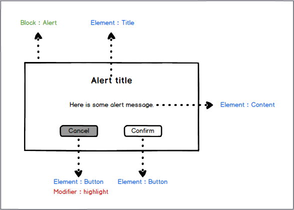
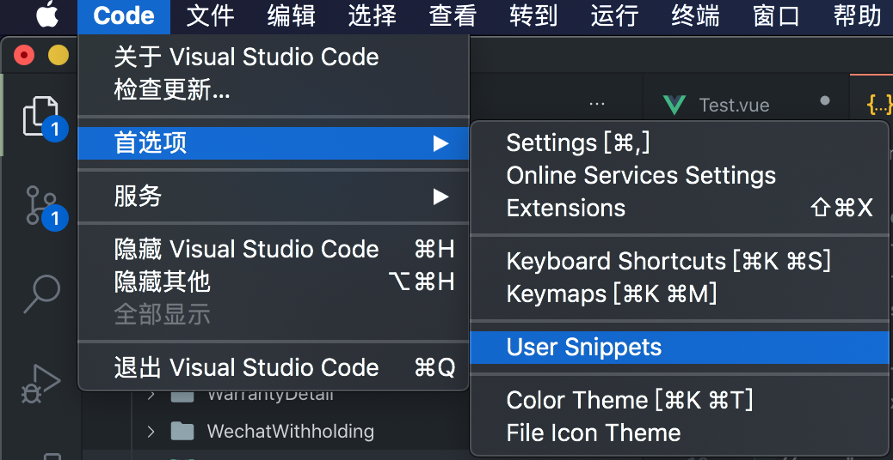
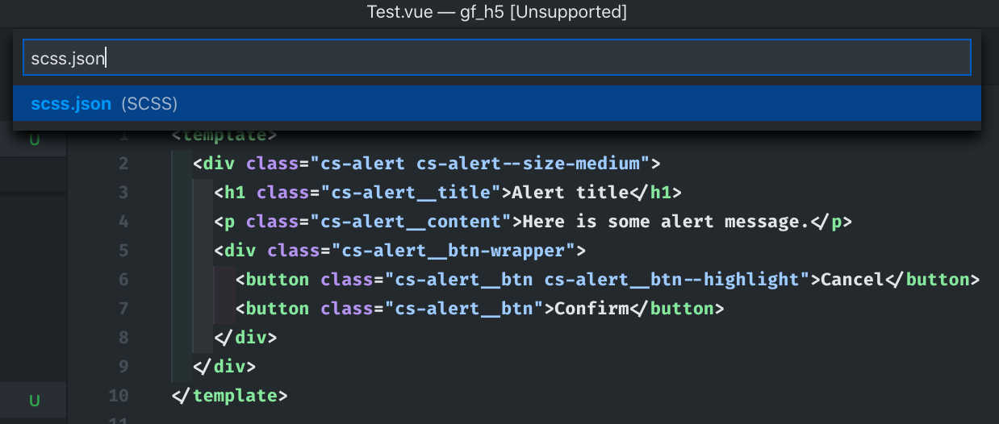

[[TOC]]

## 什么是 BEM？

「[BEM](https://en.bem.info/methodology/){target=\_blank}」是一种关于如何编写高可维护性的「CSS」代码的方法论，它提出的概念是将用户界面划分为独立的块，使复杂界面开发变得更加快速和简单。这种方法论背后的想法和现代前端开发的「组件化」理念是高度一致的，如最新的「web components」规范，流行的前端开源框架「Angular」、「React」和「Vue」等。

### BEM 的定义

「BEM」这个词分别由`Block`、`Element`和`Modifier`组成，也即是 **_块_**、**_元素_** 和 **_修饰器_**，如下图所示：



绿色标记的是「Block」，代表有意义的独立实体。蓝色标记的是「Element」，代表属于块的元素部分。红色标记的是「Modifier」，代表用来修改块或元素的标志。

### 代码实现

上图的「Alert」提示框用代码来实现是这样的：

```html
<div class="alert alert--size-medium">
  <h1 class="alert__title">Alert title</h1>
  <p class="alert__content">Here is some alert message.</p>
  <div class="alert__btn-wrapper">
    <button class="alert__btn alert__btn--highlight">Cancel</button>
    <button class="alert__btn">Confirm</button>
  </div>
</div>
```

**_Note_**:留意这里的 HTML 结构，元素是可以包含元素的，同理「块」也是可以包含「块」的，我们使用「BEM」处理的不是嵌套关系。

```css
.alert {
  /* some code here */
}
.alert--size-medium {
  /* some code here */
}
.alert__title {
  /* some code here */
}
.alert__content {
  /* some code here */
}
.alert__btn-wrapper {
  /* some code here */
}
.alert__btn {
  /* some code here */
}
.alert__btn--highlight {
  /* some code here */
}
```

### BEM 的优点

使用了「BEM」之后，可以看到几个明显的好处：

1. **模块化：**
   块的样式从不依赖于页面上的其他元素，所以永远不会遇到级联问题。而且当遇到需要将模块从已完成的项目转移到新的项目中的时候，「BEM」的结构代码很容易迁移。

2. **复用性：**
   以不同的方式组合独立的块，并根据情况重用它们，可以减少需要维护的 CSS 代码数量。

3. **结构化：**
   「BEM」给 CSS 代码提供了一个坚实的结构，保持简单和容易理解。

[本博客](https://lkangd.com){target=\_blank}的样式就是应用了「BEM」的理念去编写的，而且为了增强独立性，还在 Class 名称前面加了「cs-」的命名空间。

### BEM 的缺点

可以看到使用了「BEM」来编写 CSS 之后，每个 Class 的名字变得很长，所以才会有人吐槽这就像是老太太的裹脚布——又长又臭。这是个容易解决的小问题，现代前端开发已经普遍使用[「CSS 预处理器」](https://developer.mozilla.org/zh-CN/docs/Glossary/CSS_preprocessor){target=\_blank}来帮助编码工作者更好地书写 CSS，利用这些预处理器的「嵌套」、「父类引用」、「模块」等规则，可以让「BEM」编写量变低，编写速度更快。下面来介绍当前最流行的一种预处理器 ——「SCSS」

---

## 什么是 SCSS？

[SCSS](https://sass-lang.com/){target=\_blank} 是一个「CSS 预处理器」， 它提供了很多「嵌套」、「父类引用」、「模块」方便快捷的规则来帮助你更加快速地编写 CSS，在你代码正式落地到业务之前转换为真正的 CSS。SCSS 的语法完全兼容 CSS3，并且继承了 Sass 的强大功能。也就是说，任何标准的 CSS3 样式表都是具有相同语义的有效的 SCSS 文件。

### SCSS 的安装使用

1. **独立使用**
   安装命令：

   ```bash
   npm install -g sass
   ```

   创建后缀为 index.scss 的文件，编写样式：

   ```css
   .block {
     /* some code here */
     &--modifier {
       /* some code here */
     }
     &__element {
       /* some code here */
       &--modifier {
         /* some code here */
       }
     }
   }
   ```

   运行转换命令：

   ```bash
   sass source/stylesheets/index.scss build/stylesheets/index.css
   ```

   转换结果，index.css:

   ```css
   .block {
     /* some code here */
   }
   .block--modifier {
     /* some code here */
   }
   .block__element {
     /* some code here */
   }
   .block__element--modifier {
     /* some code here */
   }
   ```

   **_Tip_**: 你可以到[sassmeister](https://www.sassmeister.com/){target=\_blank}查看 SCSS 实时编译为 CSS 的代码。

2. **配合打包工具使用**
   这里只介绍配合 webpack 使用，安装 sass 和相关 loader 到项目内：

   ```bash
   npm install css-loader style-loader node-sass sass-loader -D
   ```

   改写 webpack 配置，注意 loader 的顺序，执行打包命令之后就会对使用到的 scss 文件进行转换，转换结果跟上面一样：

   ```javascript{7}
   module.exports = {
     // 其它配置省略
     module: {
       rules: [
         {
           test: /\.scss/,
           use: ['style-loader', 'css-loader', 'sass-loader'],
         },
       ],
     },
   };
   ```

### SCSS 下的 BEM 编写

使用 SCSS 对上面的「Alert」组件的 CSS 部分进行重写：

```css
.alert {
  /* some code here */
  &--size-medium {
    /* some code here */
  }
  &__title {
    /* some code here */
  }
  &__content {
    /* some code here */
  }
  &__btn-wrapper {
    /* some code here */
  }
  &__btn {
    /* some code here */
    &--highlight {
      /* some code here */
    }
  }
}
```

可以看到利用 SCSS 的嵌套和父类名称引用，不再需要重复编写前面相同的部分，节省了大量的编写工作。

看到这里你可能会疑惑，这跟使用其它 CSS 预处理器没有区别啊，而且看起来还是很长。虽然使用了块、元素和修饰符之间的连接符，能一眼分辨出当前 Class 的种类，但是当需要大量重复编写的话，会让人很也不爽。下面进入正题，看看如何使用 SCSS 的优势来解决这两个问题。

---

## 组合增强

Sass 在版本 3.3 更新了一个新的@（At-Rules）规则：[`@at-root`](https://sass.bootcss.com/documentation/at-rules/at-root){target=\_blank}。它的作用是将嵌套内的 CSS 嵌套作用域移至当前 SCSS 文件的根作用域，可以说这个规则真的是为「BEM」而生的，它可以让「BEM」编写起来更语义化、更快捷优雅。

### 增强语义化

这一步需要借助 SCSS 的[`mixins`](https://sass-lang.com/documentation/at-rules/mixin){target=\_blank}来给「BEM」三个部分定一个语义化的 mixin，以求一眼就可以看出 class 的种类，而且不用编写连接符，第一个简单版本是这样的：

```css{11,13}
/* 先定义三种 class 的 mixin */
$element-separator: '__';
$modifier-separator: '--';

@mixin block($block) {
  .#{$block} {
    @content;
  }
}
@mixin element($element) {
  /* 这里使用@at-root 将 mixin 的内容体提升至根作用域，使生成的 element 代码其不再嵌套在 block 内 */
  @at-root {
    /* 这里符号 & 拿到父选择器的部分 */
    #{& + $element-separator + $element} {
      @content;
    }
  }
}
@mixin modifier($modifier) {
  @at-root {
    #{& + $modifier-separator + $modifier} {
      @content;
    }
  }
}

/* 然后这样使用 */
@include block(alert) {
  /* some code here */
  @include modifier(size-medium) {
    /* some code here */
  }
  @include element(title) {
    /* some code here */
  }
  @include element(content) {
    /* some code here */
  }
  @include element(btn-wrapper) {
    /* some code here */
  }
  @include element(btn) {
    /* some code here */
    @include modifier(highlight) {
      /* some code here */
    }
  }
}
```

第一个简单粗暴直接拼接的版本会带来一个问题，就是当 block--modifier 内嵌 block\_\_element 或者 block\_\_element 嵌套 block\_\_element 的时候，得到的代码不会是真正想要的：

```css{24,28}
/* 比如当设置中型（size-medium） alert 时，title 需要改变 */
@include block(alert) {
  /* some code here */
  @include modifier(size-medium) {
    /* some code here */
    @include element(title) {
      /* some code here */
    }
  }
  @include element(btn-wrapper) {
    /* some code here */
    @include element(btn) {
      /* some code here */
    }
  }
}
/* 生成的CSS */
.alert {
  /* some code here */
}
.alert--size-medium {
  /* some code here */
}
/* 这里的期望其实是 .alert--size-medium .alert__title */
.alert--size-medium__title {
  /* some code here */
}
/* 这里的期望其实是 .alert__btn-wrapper .alert__title */
.alert__btn-wrapper__btn {
  /* some code here */
}
```

所以这里需要处理的问题有两个：

1. 判断`Element`的父选择器是不是包含连接符号，也就是“--”或者“\_\_”；
2. 如果遇到父选择器包含连接符号“--”或者“\_\_”的情况，需要取到父选择器中的「block」部分，也就是「.alert--size-medium」中「.alert」；

首先解决第一个问题，实现起来也很简单，用 SCSS 自带的字符串函数[str-index](https://sass-lang.com/documentation/modules/string#index){target=\_blank}来判断，然后加个流程控制就可以了：

```css
/* 封装一下判断函数 */
@function containsSeparator($selector) {
  $selector: selectorToString($selector);

  @if str-index($selector, $modifier-separator) or str-index($selector, $element-separator) {
    @return true;
  } @else {
    @return false;
  }
}
```

然后是第二问题，可以使用 SCSS [全局变量](https://sass-lang.com/documentation/variables#scope){target=\_blank}来记录 block 的选择器，而不再用使用原来的“&”符号作为「block」的部分：

```css
/* 先改写block mixin，使其每次被调用时，记录当前的选择器 */
@mixin block($block) {
  $B: $block !global;
  .#{$block} {
    @content;
  }
}
/* 然后结合上一步的流程控制，改写 element mixin */
@mixin element($element) {
  $E: $element !global;
  @if containsSeparator(&) {
    @at-root {
      /* 注意这里需要在前面添加“& ”，维持嵌套规则 */
      & #{'.' + $B + $element-separator + $element} {
        @content;
      }
    }
  } @else {
    @at-root {
      /* 原来的逻辑不变，这里符号 & 拿到父选择器的部分 */
      #{& + $element-separator + $element} {
        @content;
      }
    }
  }
}
```

然后就可以完美地解决两个问题了，无论你嵌套多少层，SCSS 都能输出正确的 CSS。

### 完整代码实现

其实这里可以再优化一下，将三种类型的 mixin 使用首字母缩写的方式来命名，也即是`b`，`e`，`m`。上面还提到需要加命名空间的情况，可以使用`B`来进行区别，完整实现代码如下：

```css
$name-space: 'cs-'; /* 根据需要自定义命名空间，比如本博客的“cs-” */
$element-separator: '__';
$modifier-separator: '--';

@function containsSeparator($selector) {
  $selector: selectorToString($selector);

  @if str-index($selector, $modifier-separator) or str-index($selector, $element-separator) {
    @return true;
  } @else {
    @return false;
  }
}

@mixin B($block) {
  $B: #{$name-space + $block} !global;
  .#{$B} {
    @content;
  }
}

@mixin b($block) {
  $B: $block !global;
  .#{$block} {
    @content;
  }
}

@mixin e($element) {
  $E: $element !global;
  @if containsSeparator(&) {
    @at-root {
      & #{'.' + $B + $element-separator + $element} {
        @content;
      }
    }
  } @else {
    @at-root {
      #{& + $element-separator + $element} {
        @content;
      }
    }
  }
}
@mixin m($modifier) {
  @at-root {
    #{& + $modifier-separator + $modifier} {
      @content;
    }
  }
}
```

### 使用 Snippet

最后，需要设置代码编辑器来帮助编写海量的 `@include [mixin_name] {}` 关键字，因为我使用的是 VSCode，所以这里只说 VSCode 的设置方法，其它代码编辑器应该也是类似的。设置步骤如下：

1. 打开 VSCode 首选项，然后选择「用户代码片段」
   
2. 在弹出的输入框内输入「scss.json」
   
3. 输入形如下面的内容

```json
{
  // Place your snippets for scss here. Each snippet is defined under a snippet name and has a prefix, body and
  // description. The prefix is what is used to trigger the snippet and the body will be expanded and inserted. Possible variables are:
  // $1, $2 for tab stops, $0 for the final cursor position, and ${1:label}, ${2:another} for placeholders. Placeholders with the
  // same ids are connected.
  // Example:
  // "Print to console": {
  // 	"prefix": "log",
  // 	"body": [
  // 		"console.log('$1');",
  // 		"$2"
  // 	],
  // 	"description": "Log output to console"
  // }
  "Scss BEM B": {
    "prefix": "iB",
    "body": ["@include B($1) {", "  $2", "}"]
  },
  "Scss BEM b": {
    "prefix": "ib",
    "body": ["@include b($1) {", "  $2", "}"]
  },
  "Scss BEM e": {
    "prefix": "ie",
    "body": ["@include e($1) {", "  $2", "}"]
  },
  "Scss BEM m": {
    "prefix": "im",
    "body": ["@include m($1) {", "  $2", "}"]
  },
  "Scss BEM pseudo": {
    "prefix": "ip",
    "body": ["@include pseudo($1) {", "  $2", "}"]
  },
  "Scss BEM when": {
    "prefix": "iw",
    "body": ["@include when($1) {", "  $2", "}"]
  },
  "Scss BEM share rule": {
    "prefix": "isr",
    "body": ["@include share-rule($1) {", "  $2", "}"]
  },
  "Scss BEM extend rule": {
    "prefix": "ier",
    "body": ["@include extend-rule($1);"]
  },
  "Scss utils ellipsis": {
    "prefix": "ime",
    "body": ["@include utils-ellipsis;"]
  },
  "Scss utils transitions": {
    "prefix": "imt",
    "body": ["@include utils-transitions($1, $2, $3);"]
  },
  "Scss utils extend-click": {
    "prefix": "imec",
    "body": ["@include utils-extend-click;"]
  },
  "Scss utils bt-1px": {
    "prefix": "imbt1",
    "body": ["@include utils-bt-1px($1);"]
  },
  "Scss utils b1px": {
    "prefix": "imb1",
    "body": ["@include utils-b-1px($1);"]
  },
  "Scss utils bb-1px": {
    "prefix": "imbb1",
    "body": ["@include utils-bb-1px($1);"]
  },
  "Scss utils hide-scrollbar": {
    "prefix": "imhs",
    "body": ["@include utils-hide-scrollbar;"]
  }
}
```

上面是我根据个人习惯自定义的 mixin 快捷 prefix，比如键入“ib”回车就编辑器就会自动带出`@include b($1){$2}`，并将光标定位到$1的位置，这个时候输入完 block 的名称后按「tab」键光标就会定位到$2 的位置，使用起来非常方便，就像下图这样子：


## 结语

社区里关于「如何编写高可维护的 CSS 代码」的讨论话题中，「BEM」一直占有一席之地，其结构化的 CSS 和 UI 的优势，使很多多人协作的前端项目受益。在 Github 的热门库[Front-end roadmap](https://github.com/kamranahmedse/developer-roadmap#frontend-roadmap){target=\_blank}中也是被广大开发者优先推荐的。

本文提到的「BEM」结合「SCSS」进行高效率编写代码的方式其实最早由[Marc Mintel](https://twitter.com/marcmintel){target=\_blank}在 medium [提出](https://medium.com/@marcmintel/pushing-bem-to-the-next-level-with-sass-3-4-5239d2371321){target=\_blank}，而且在热门的开源 UI 库[element.js](https://element.eleme.io/){target=\_blank}中[大量使用](https://github.com/ElemeFE/element/blob/dev/packages/theme-chalk/src/mixins/mixins.scss){target=\_blank}，其实现更为完善，可以前往继续学习。
